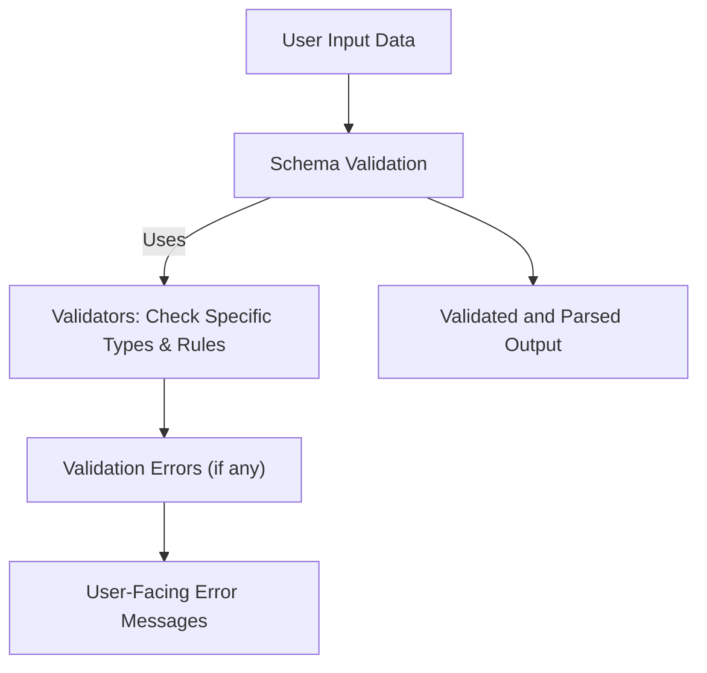

## Understanding Valdi’s Core Concepts and Terminology

Working effectively with Valdi begins with grasping the key concepts and language that shape its validation ecosystem. These foundational elements—validators, types, errors, and schemas—are the building blocks that define how data is interpreted, validated, and communicated in user-facing APIs. By mastering these ideas, you gain the clarity needed to design robust validation flows tailored to your data’s requirements.

## What Valdi’s Core Concepts Mean for You

At its essence, Valdi organizes validation through the use of *validators*—specialized components that check if data meets expected criteria. These validators apply to distinct *types* of data, ensuring each value conforms precisely. When validation fails, *errors* emerge, encapsulating what went wrong in terms users can understand. All these role-based elements come together inside *schemas*, which describe the complete expected shape, rules, and constraints of your data.

This language amounts to a shared vocabulary that aligns your thinking and code. Whether you are defining a simple type check or complex nested structures, understanding this terminology is critical as you traverse Valdi’s APIs and workflows. It empowers you to trace the lifecycle of data—from input to validation outcome—bridging gaps between requirements and implementation.

## How Valdi Structures Validation: A High-Level View

At its core, Valdi operates by layering abstractions that interact smoothly through a clear, modular process. Validators are the functional units that embody individual checks, each associating tightly with one or more fundamental data types such as strings, numbers, or objects. These validators compose within schemas that represent the full data model.

When data flows through Valdi, each validator evaluates its target segment and flags violations. These results accumulate as a structured tree of errors corresponding to the schema’s shape—enabling detailed insights about which piece of data failed and why.



This streamlined flow highlights how validators serve as the engines within schemas, actively scanning incoming data and producing targeted errors when expectations are unmet.

## Putting Concepts to Work in Real Situations

Imagine you are validating a user registration form. A schema might specify fields like `email`, `password`, and `age`, each backed by type validators ensuring emails are formatted correctly, passwords meet complexity standards, and age is an integer within allowed bounds. When a user submits invalid data, Valdi pinpoints exactly which fields failed and why—returning error objects that your application can use to inform users precisely on required corrections.

For example, a snippet of a schema definition for an email field could look like this:

```javascript
const emailValidator = valdi.string().email();
const userSchema = valdi.object({
  email: emailValidator,
  password: valdi.string().minLength(8),
  age: valdi.number().int().min(18)
});
```

Running this schema against input data yields a tree of errors tied to fields, which you can parse and display on the client to improve the registration experience.

In more advanced cases, schemas can nest deeply and combine validators to reflect complex business rules, maintaining clear error traceability throughout.

## Preparing to Work with Core Concepts

Getting started involves familiarizing yourself with the terminology and experimenting with simple types and validators. This foundational knowledge sets the stage for successfully integrating schemas into your applications and handling the errors Valdi reports meaningfully.

To dive deeper, proceed to the [Feature Overview & Example Workflows](/overview/getting-started/feature-overview-examples) page for practical demonstrations and common usage patterns. You might also want to explore the [Validator Classes and Functions](/api-reference/core-api/validators) section to see detailed API references.

<Tip>
Start by defining small schemas with clear validators to observe how Valdi surfaces validation issues before moving on to modeling complex data structures.
</Tip>

<Source url="https://github.com/Snapchat/Valdi" branch="main" paths={[{"path": "src/core/validators.ts", "range": "10-75"},{"path": "src/core/schema.ts", "range": "30-95"}]} />