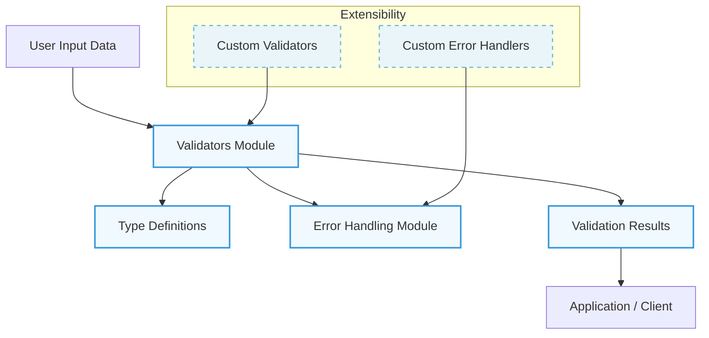

## Understanding Valdi’s System Architecture

When building robust data validation workflows, understanding how the components fit together is crucial. The System Architecture Diagram page provides a clear, visual representation that highlights Valdi’s internal structure, helping technical users grasp how data validation flows through core modules and where customization fits.

This page is designed to give you both a big-picture perspective and an entry point into the modular design of Valdi, so you can effectively position it within your application stack and extend it as needed.

## Defining Valdi’s Core Structure and Audience

At its core, Valdi is an extensible validation framework composed primarily of three pillars: validators, types, and error handling. These modules collaborate to ensure input data meets defined schemas, delivering precise validation results that your applications depend on. 

This documentation page is primarily aimed at developers, architects, and technical decision-makers who need to integrate Valdi into existing systems or build advanced validation capabilities. Understanding this architecture ensures they can leverage Valdi with confidence and tailor its components to specific project needs.

## How Valdi’s Architecture Supports Validation

The architecture places validators at the center, orchestrating the validation process by applying type definitions against incoming data inputs. Types act as blueprints describing data shape and constraints, while error modules capture and report any validation failures clearly and consistently.

The diagram further reveals crucial extensibility points that allow integration of custom validators and error handlers. Data flows from user input through validation logic before generating structured error reports or success confirmations, supporting robust error handling and feedback in applications.



This high-level depiction clarifies where Valdi fits within your data validation workflow: it acts as the authoritative gatekeeper, validating data shapes and rules, then communicating outcomes downstream.

## Seeing Valdi in Action

Imagine a web service receiving JSON payloads that must conform to complex schemas. Valdi’s types define each field’s expected format, while validators check compliance. If an address field is missing or a date is invalid according to the defined types, the error module catches these violations and returns informative error responses to clients.

Developers can extend Valdi’s capabilities by implementing custom validators to support domain-specific checks beyond standard data types—such as validating business rules or API keys. This modularity keeps core validation streamlined while enabling powerful adaptations.

Here is a brief UI snippet conceptualizing the validation result flow:

```javascript
const result = valdi.validate(data, schema);
if (!result.isValid) {
  console.log('Validation Errors:', result.errors);
} else {
  console.log('Data is valid and ready for processing.');
}
```

This common pattern demonstrates the practical outcome of the architecture: robust validation feedback that informs application logic and user interactions.

## Getting Started and Exploring Further

With a grasp of the underlying architecture, you’re well-prepared to proceed with installing Valdi and crafting your first validation workflows. To continue, visit the [Installation Guide](/getting-started/setup-and-installation/installation-guide) to set up your environment. 

For new users eager to understand the fundamental product value and terminology, the [What is Valdi? Product Introduction & Value](/overview/getting-started/introduction-product-value) and [Core Concepts and Terminology](/overview/getting-started/core-concepts-terminology) pages provide essential background. Those ready to dive into example scenarios will find the [Feature Overview & Example Workflows](/overview/getting-started/feature-overview-examples) particularly valuable.

Embracing this architecture knowledge equips you to unlock the full potential of Valdi’s validation capabilities with clarity and confidence.

<Source url="https://github.com/Snapchat/Valdi" branch="main" paths={[{"path": "docs/architecture/architecture-diagram.md", "range": "1-60"}]} />